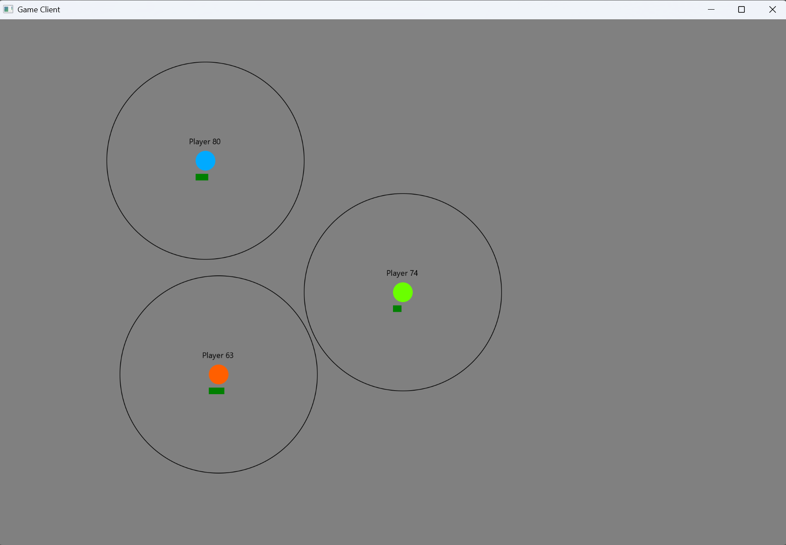
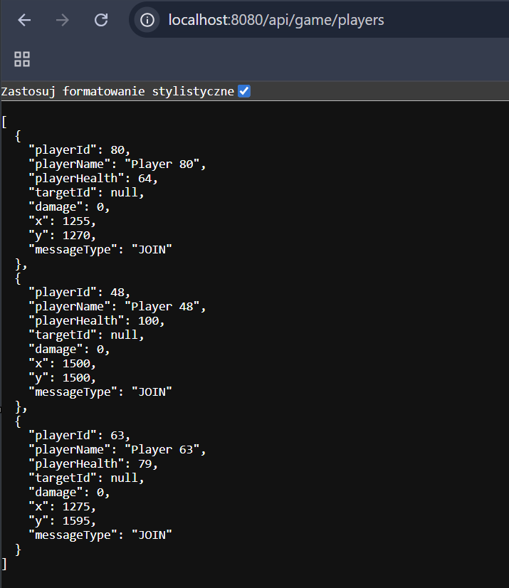

# Multiplayer Combat Game

**Real-time multiplayer game built with Spring Boot and JavaFX.** Players move around, attack each other, and see live updates via WebSocket.

---

## Gameplay
*Multiple players in combat with health bars*



Players can move freely, attack, and observe others’ movements in real time.

---

## Quick Start

### 1. Start Server

* Open **servergame** in IntelliJ
* Run **ServerGameApplication.java**
* Server starts on `localhost:8080`

### 2. Start Client

* Open **clientgame** in IntelliJ
* Run **ClientApplicationRun.java**
* Launch multiple instances to play together

### 3. Controls

* `W / A / S / D` — Move
* `B` — Attack

---

## How It Works

```
JavaFX Client  ←→  WebSocket (STOMP)  ←→  Spring Boot Server
                         ↓
                       REST API
```

The server is authoritative — it calculates damage and manages all game state. Clients send inputs and render live updates.

---

## Tech Stack

* **Backend:** Spring Boot, WebSocket (STOMP), REST API
* **Client:** JavaFX, Canvas rendering, STOMP client

---

## Features

* Real-time multiplayer (up to 100 players)
* Server-authoritative combat (prevents cheating)
* Health bars and attack range indicators
* Camera system that follows player
* REST API for querying game state

---

## Documentation

* **Server README:** WebSocket handlers, REST endpoints, game logic
* **Client README:** Rendering, controls, camera system

---

## REST API Example

**GET** `/api/game/players`

Returns all online players as JSON:



## What I Learned

* Real-time communication with WebSocket/STOMP
* Server-authoritative game architecture
* Thread-safe state management (`ConcurrentHashMap`)
* JavaFX Canvas rendering and event handling
* Combining WebSocket + REST in one application

---

## Known Issues

* Player IDs are random 1–100 (can collide)
* Attack hits everyone (no targeting)
* No authentication or persistence
* Missing error handling for disconnects

> Built as a learning project to understand real-time networking and game development.

---

## Other Projects

* **SPH Fluid Simulation** — Physics simulation with 1000+ particles
# multiplayer-combat-game
